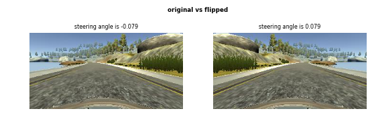
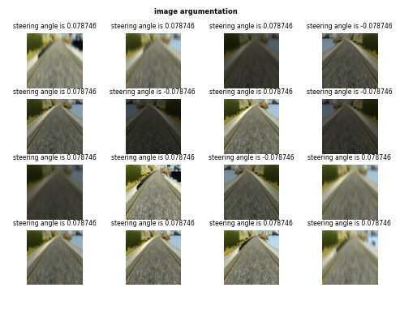
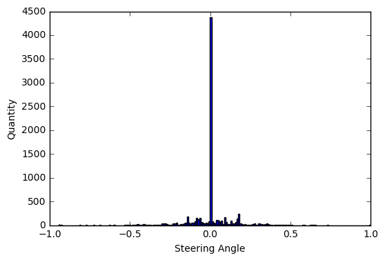
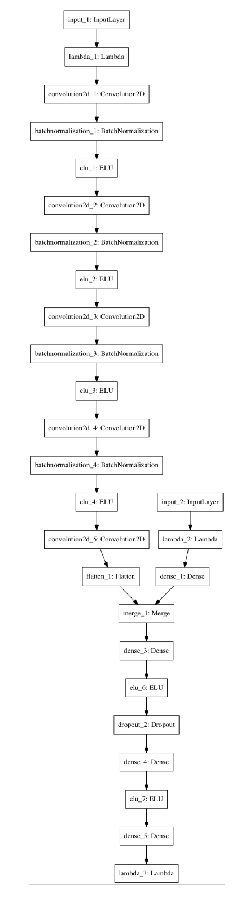

# Behavior Cloning

<<<<<<< HEAD
### The model was tested using Dell XPS 8910 Desktop Intel Core i5-6400 Nvidia GTX1070

### Platform: Windows10

### Simulation mode: 640*480 + Fantastic

### put Udacity tarck 1 data under ***data*** folder before run model.py
=======
### The model was tested using Dell XPS 8910 Desktop Intel Core i5-6400 Nvidia GTX1070 
### Platform: Windows10 
### Simulation mode: 640*480 + Fantastic 
>>>>>>> origin/master

### data/images helper functions

#### load modules


```python
import csv
import math
import numpy as np
import random
from PIL import Image
import cv2
import matplotlib.pyplot as plt
%matplotlib inline
```

#### Image helper functions

These functions are mainly used for data loading, images argumentation, images corping/resize, etc


```python
# corp the top 1/3 and bottom 25 pixels from the image, then resize new
# image to 64*64
def preprocess_img(image, new_size_col=64,new_size_row=64):
    image = np.asarray(image)
    shape = image.shape
    image = image[math.floor(shape[0]/3):shape[0]-25, 0:shape[1]]
    image = cv2.resize(image,(new_size_col,new_size_row),
                        interpolation=cv2.INTER_AREA)
    return image


# load images of different types from specificed path, and return turn
#the images array
def imgs_preprocesses(file_paths, row):
    ary = []
    for file_dir in file_paths:
        path="./data/"+row[file_dir]
        path=path.replace(" ","")
        img = Image.open(path)
        ary.append(img)
    return ary


# brightness agumentation, for more info refer to
# https://chatbotslife.com/using-augmentation-to-mimic-human-driving-496b569760a9#.yh93soib0
def img_brightness_argumentation(img):
    img = np.asarray(img)
    hsv_img = cv2.cvtColor(img,cv2.COLOR_RGB2HSV)
    random_bright = .35+np.random.uniform()
    hsv_img[:,:,2] = hsv_img[:,:,2]*random_bright
    return cv2.cvtColor(hsv_img,cv2.COLOR_HSV2RGB)


def img_bluring_argumentation(img):
    img = np.asarray(img)

    # choose a random bluring index
    rand_blur_idx = random.choice([3,5,7])

    # decide whether we should use standard bluring on this step
    img = (cv2.blur(img,(rand_blur_idx,rand_blur_idx))
           if random.randint(0,1)==1 else img)

    # decide whether we should use Gaussian bluring on this step
    img = (cv2.GaussianBlur(img,(rand_blur_idx,rand_blur_idx),0)
           if random.randint(0,1)==1 else img)

    # decide whether we should use median bluring on this step
    img = (cv2.medianBlur(img,rand_blur_idx)
           if random.randint(0,1)==1 else img)
    return img


# this function is mainly used by training to generate various
# combination of image argumentation
def img_argumentation(img):
    # decide whether we should use brightness arguementation on this step
    arg_img = (img_brightness_argumentation(img)
               if random.randint(0,1)==1 else img)

    # decide whether we should use any bluring arguementation on this step
    arg_img = (img_bluring_argumentation(arg_img)
               if random.randint(0,1)==1 else arg_img)

    return arg_img
```


```python
data_file = "./data/driving_log.csv"

# choose a random row of driving record from the CSV file  
row = copier[random.randint(0, len(copier)-1)]

target_angl_data_cn = float(row['steering'])

camera_file_type = ["center"]
target_angl_data = [target_angl_data_cn]
imgs = [img_cn] = imgs_preprocesses(camera_file_type,row)

fliped_imgs = list(map(lambda img: np.fliplr(img), imgs[::]))
fliped_target_angl_data = [-1*target_angl_data_cn]

all_imgs = imgs+fliped_imgs
all_steer_angl = target_angl_data+fliped_target_angl_data
```

#### Flipped Images


```python
fig_org = plt.figure()
fig_org.suptitle('original vs flipped', fontsize=6, fontweight='bold')
for idx,img in enumerate(all_imgs):
    fig_org.add_subplot(1,2,idx+1)
    plt.axis('off')
    plt.title("steering angle is "+str(round(all_steer_angl[idx],3)),fontsize=5.5)
    plt.imshow(img)
    plt.subplots_adjust(left=0.1, right=0.9, top=1.4, bottom=0.1)
```





#### Images Argumentation


```python
fig = plt.figure()
fig.suptitle('image argumentation', fontsize=6, fontweight='bold')
for idx in range(16):
    rand_idx = random.randint(0,len(all_imgs)-1)
    img = img_argumentation(all_imgs[rand_idx])
    img = preprocess_img(img)
    fig.add_subplot(4,4,idx+1)
    plt.axis('off')
    plt.title("steering angle is "+str(round(all_steer_angl[rand_idx],6)),fontsize=5.5)
    plt.imshow(img)
```





### About the data

if we look at the steering angle within the data that provided by Udacity, we can find that the data set itself is very unbalanced(see below) due to the game terrain, this will cause the error of generlizing. The situation worsen in our model, because we want to train the network using mean square error to predict continues steering angle instead of classified lables. These casue the optimizer to minimize error at the common driving scenario (i.e: straight) and fail at other scenario (i.e: sharp turn)  

There are couple ways that can fix the issue. One can get more balance data, and train the network in a lager dataset, this will cause the training time to increase. The second method is to increse the steering angle porpotional to the by the one that output by the model, which in some sense will increse wobbling in driving straight line.

<<<<<<< HEAD
In our case, we increse the steering angle 3 times comapre to the one output from model(refer to ***drive.py***).
=======
In our case, I incresed the steering angle 3 times comapre to the one output from model(refer to ***drive.py***). 
>>>>>>> origin/master


```python
all_angles = list(map(lambda x: float(x["steering"]), copier))
fig = plt.figure()
fig.add_subplot()
plt.hist(all_angles,200)
plt.xlabel("Steering Angle")
plt.ylabel("Quantity")
plt.show()
```





### The model
 This model is based on the nvidia paper, with addtional speed input layer and batch normalization
 layers for the conv layers
 reference:
 http://images.nvidia.com/content/tegra/automotive/images/2016/solutions/pdf/end-to-end-dl-using-px.pdf

#### loading Keras Modules


```python
import tensorflow as tf
from keras.models import Model
from keras.models import model_from_json

from keras.layers import Input, Flatten, Dense, Lambda,\
                         Convolution2D, Dropout, merge

from keras.layers.normalization import BatchNormalization

from keras.layers.advanced_activations import ELU

from keras.callbacks import ModelCheckpoint, ReduceLROnPlateau
from keras.optimizers import Adam
```

#### reload model & weights helper


```python
# this function is mainly used by continue training the network
# that has been previous trained. One can do that by setting
# continue_training to True in main function
def load_model_and_weights(model_json, model_file):
    json_file = open(model_json,'r')
    loaded_model_json = json_file.read()
    json_file.close()
    final_model = model_from_json(loaded_model_json)
    final_model.load_weights(model_file)
    return final_model
```

#### the model


```python
# This model is based on the nvidia paper, with addtional speed input layer and batch normalization
# layers for the conv layers
# reference:
# http://images.nvidia.com/content/tegra/automotive/images/2016/solutions/pdf/end-to-end-dl-using-px.pdf
def model():

    images_input = Input(shape=(64, 64, 3))

    # normalized each pixel within an input image  
    normalized_images_input = Lambda(lambda x: x/255.0,
                                    input_shape=(64, 64, 3),
                                    output_shape=(64, 64, 3),
                                )(images_input)

    model_center = Convolution2D(
                            24, 5, 5,
                            subsample=(2, 2),
                            border_mode='valid')(normalized_images_input)
    model_center = BatchNormalization()(model_center)
    model_center = ELU()(model_center)

    model_center = Convolution2D(
                            36, 5, 5,
                            subsample=(2, 2),
                            border_mode='valid')(model_center)
    model_center = BatchNormalization()(model_center)
    model_center = ELU()(model_center)

    model_center = Convolution2D(
                            48, 5, 5,
                            subsample=(2, 2),
                            border_mode='valid')(model_center)
    model_center = BatchNormalization()(model_center)
    model_center = ELU()(model_center)


    model_center = Convolution2D(
                            64, 3, 3,
                            subsample=(1, 1),
                            border_mode='valid')(model_center)
    model_center = BatchNormalization()(model_center)
    model_center = ELU()(model_center)

    model_center = Convolution2D(
                            64, 3, 3,
                            subsample=(1, 1),
                            border_mode='valid')(model_center)

    # flattern out the img conv layer
    model_center = Flatten()(model_center)

    # if we want to various speed for the car, we need to input the
    # speed of the car, in order for it to perdict the right steer
    # angle at different speed
    speed_input = Input(shape=(1,))
    # normalized the input speed with the maximun speed allowed
    normalized_speed_input = Lambda(lambda x: x/30.19)(speed_input)
    model_speed = Dense(16)(normalized_speed_input)

    # merge the flattened img conv layer with the speed layer, and
    # use those neuron as input to the final fully connected network
    merged = merge([model_center, model_speed], mode='concat')

    final_model = Dense(100)(merged)
    final_model = ELU()(final_model)
    # add dropout layers to prevent overfitting by introduce noise
    # https://www.quora.com/What-is-the-difference-between-Dropout-and-Batch-Normalization
    final_model = Dropout(0.4)(final_model)

    final_model = Dense(50)(merged)
    final_model = ELU()(final_model)
    # add dropout layers to prevent overfitting by introduce noise
    final_model = Dropout(0.8)(final_model)

    final_model = Dense(10)(final_model)
    final_model = ELU()(final_model)

    final_model = Dense(1)(final_model)

    # rescale the output by 25 times, since the output steering
    # angle can vary between -25 to 25
    final_model = Lambda(lambda x: x*25.0)(final_model)

    return ([images_input, speed_input], final_model)
```

#### model ploting


```python
from keras.utils.visualize_util import plot
final_model = load_model_and_weights('model.json','model.h5')
plot(final_model, to_file='model.png')
```


```python
import matplotlib.image as mpimg
img=mpimg.imread('model.png')
fig = plt.figure()
plt.axis("off")
fig.set_size_inches(18.5, 20)
plt.imshow(img)
```


    <matplotlib.image.AxesImage at 0x11a3462e8>





### conclusion

The main takeaways that I've found on doing this project are:
* neural network can be used to predict continues value as well rather than classification
* unbalanced dataset can really hurt the performance of neural network, especially in predicting continues value

Possible future imporvements
* generate a larger and more balance dataset for training
* utilize the existing model, and the transfer learning to predict the model's throttle as well, so the NN can fully control the car (in our model, we can vary the throttle, and the car can still go thru the track)
